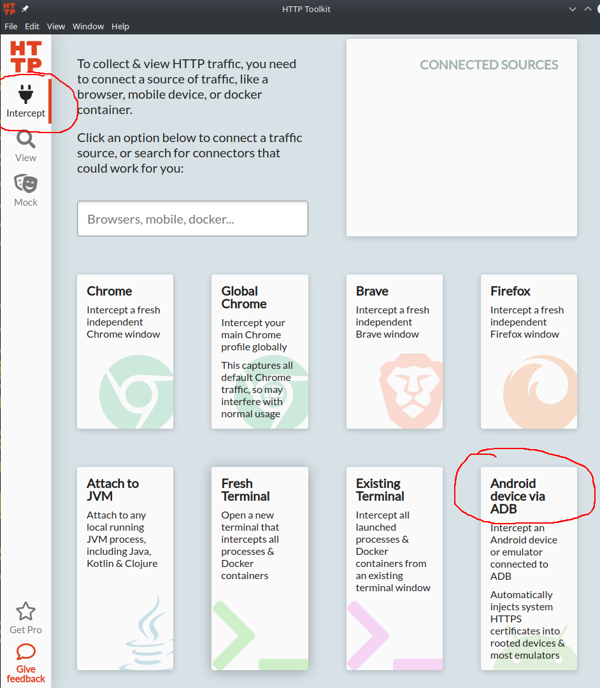
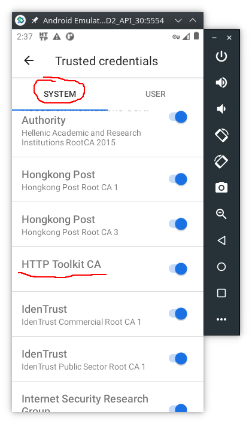
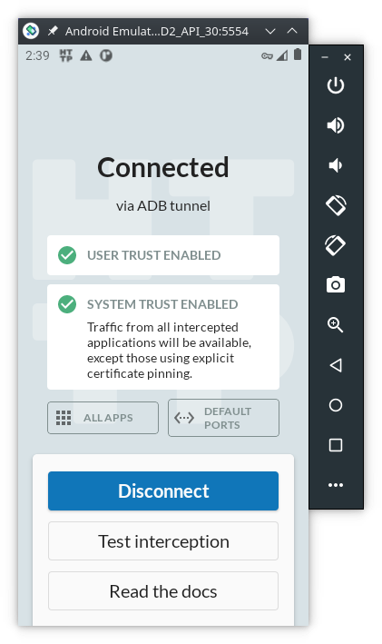
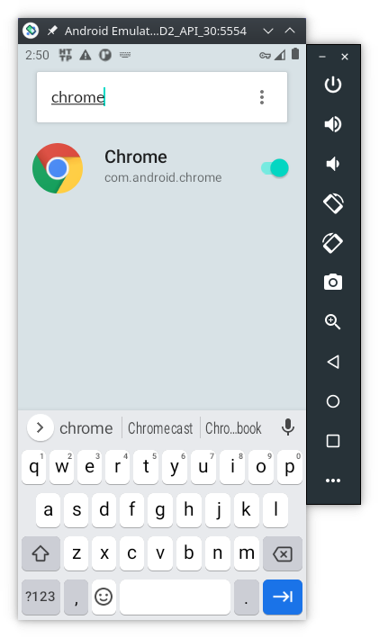
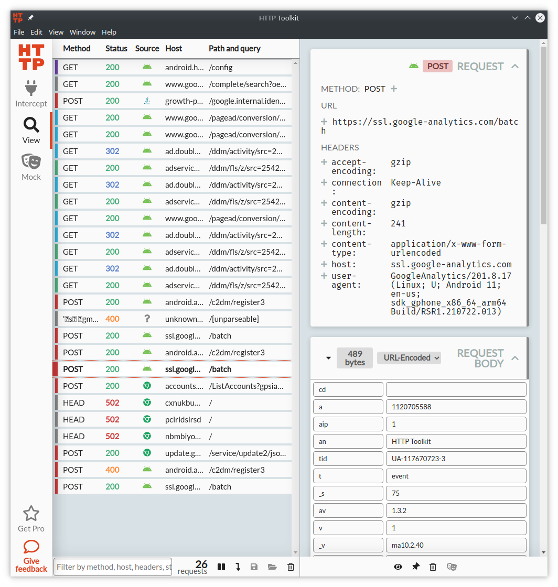
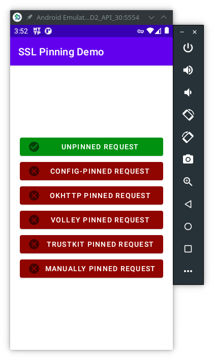
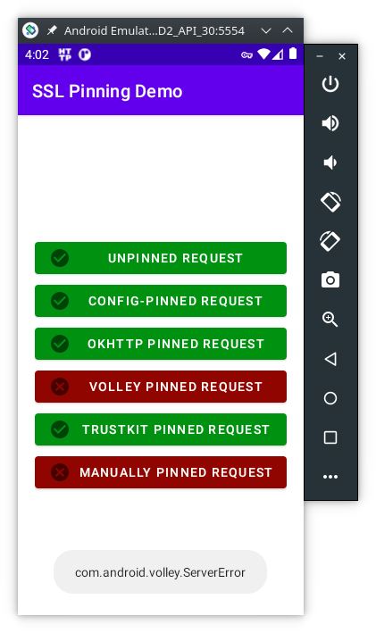

# Tutorial: Android Network Traffic Interception <!-- omit in toc -->
How to intercept network trafic on Android 

| Version | 2022.04.08 |
| :-:     | :--        |
|  | This work is licensed under a [Creative Commons Attribution-NonCommercial-ShareAlike 4.0 International License](http://creativecommons.org/licenses/by-nc-sa/4.0/) |

## Table of Contents <!-- omit in toc -->

- [Requirements](#requirements)
- [Methods](#methods)
- [HttpTolkit](#httptolkit)
- [Bypass Certificate Pinning](#bypass-certificate-pinning)
  - [Install Frida on the PC](#install-frida-on-the-pc)
  - [Install Frida on Android](#install-frida-on-android)
  - [Intercept networt traffic from APPS with certificate pinning](#intercept-networt-traffic-from-apps-with-certificate-pinning)
- [Exercises](#exercises)
  - [Exercise 1](#exercise-1)
  - [Exercise 2 (Optional)](#exercise-2-optional)
- [Recommended reading](#recommended-reading)

## Requirements

In order to implement this tutorial you need to use one of these Android devices:

- Android Virtual Device (AVD) -- see one of these tutorials: [Android Studio Emulator - GUI](https://labcif.github.io/AndroidStudioEmulator-GUIconfig/), or [Android Studio Emulator - command line](https://labcif.github.io/AndroidStudioEmulator-cmdConfig/) to learn how to set up an AVD;
  - Android 11 (API version 30) was used for this tutorial
- or a physical smartphone with Android rooted. Rooting an Android device is beyond the scope of this tutorial, but you can read this [webpage](https://magiskmanager.com/) to learn more about it.
- Python 3.x
  - Linux: already installed in most Linux distributions
  - Windows: download from [python.org](https://www.python.org/downloads/windows/)

> ***NOTE***
>
> The Android emulator uses the `x86`, or `x86_64` CPU instruction set. However, some APPs are compiled only for `arm`, or `arm64` CPU architectures. 
> If the APP you are analysing does not provide a version for `x86`, or `x86_64`, you need to use **Android 9**, or **Android 11** on the emulator, because these versions include a translation mechanism from `arm` instructions to `x86`.

## Methods

To intercept the network traffic of an Android device we need a proxy. The proxy will act as Man-in-the-middle between the Android device and the servers it connects to. There are several ways to accomplish network traffic interception:

- using a proxy on a computer, like [mitmproxy](https://mitmproxy.org/), or [PolarProxy](https://www.netresec.com/?page=PolarProxy);
- using a fake VPN on Android to act like a proxy, like [Packet Capture](https://www.apkmirror.com/?s=packet+capture), or [HTTP Toolkit](https://httptoolkit.tech/).
  
**Using a proxy on a computer** -- this method is a bit more complex to setup, but is the one that generally guarantees more flexibility to analyse the captured traffic. The main disadvantage is that all Android traffic is routed through the proxy and it's more difficult to find the packects related to the app we want to study.

**Using a fake VPN on Android** -- this is the simplest way to intercept traffic, and it allows choosing just one app to be redirected and captured. On one hand, no root permission is required, on the other hand it might require extra steps to download the captured packets to a computer.

## HttpTolkit

For this tutorial we are going to use HTTP Toolkit that sets up a fake VPN service. Download [HTTP Toolkit](https://httptoolkit.tech/) (it's available for Linux, MacOS and Windows) and then install it on your computer.

Start Android Vistual Device (AVD) and open the HTTP Toolkit software. On the main window you'll see several options, select `Android Device via ADB`:



When the option `Android Device via ADB` is selected, several things happen behind the scenes:

- the app `tech.httptoolkit.android.v1` is installed on the AVD
- the `HTTP Toolkit CA` digital certificate is added to the `Trusted credentials`:
  
  

- a fake VPN service is started on the AVD:
  
  


By default, HTTP Toolkit will intercept the network traffic from **ALL** apps and services installed on the AVD. However, we are going to analyse just one app, so let's change HTTP Toolkit configurations on the AVD:

- click the button `All APPS`
- on the 3 vertical dots menu choose `Disable all apps`
- again on the 3 vertical dots menu, choose `Show system`
- now, on the search bar type `chrome` and enable the capture:



To generate some traffic, open the Chrome browser on the AVD and type `AFD2` (or something else) on the address bar and press enter. This will make a query to google search, and the HTTP Toolkit on the computer will show the captured network packets:



However, you might not be able to access any website due to the Certificate Pinning protection. Keep reading to learn how to bypass it.

> ***NOTE***
>
> The HTTP Toolkit is an open source project hosted on [https://github.com/httptoolkit/httptoolkit](https://github.com/httptoolkit/httptoolkit). However, there are some features that are reserved for the paying costumers, namely the ability to save the captures into a file. This can be overcome by copy/paste the packets contents. Alernativelly, you can use `mitmproxy`, but the setup process is more complex.

## Bypass Certificate Pinning

After the proxy is enabled and the digital certificates are properly configured, some APPS might still not work. That happens because they are able to detect that the digital certificate we are using is not the one they expect. This technique is called [certificate pinning](https://owasp.org/www-community/controls/Certificate_and_Public_Key_Pinning). Certificate pinning is an extra step to protect SSL/TLS network traffic from Man-in-the-middle attacks, which we are trying to do.

In order to bypass certificate pinning we need to dynammicly change the network traffic. We can use [Frida](https://frida.re/), an open source tool for dynamic interception and alteration of network traffic to bypass some certificate pinning security mechanisms.

### Install Frida on the PC

To [install Frida](https://frida.re/docs/installation/) we need to have the latest Python 3.x. The latest `frida` version (15.x.x) doesn't work well on Android Emulator, so we're going to install the older version 14.2.18.

> ***NOTE***
> 
> In case you whish to have more than one version of `frida-tools` on the same computer
> create first a Python virtual environment:
> 
> ```Console
> > pip install virtualenv
> > virtualenv frida14
> > source frida14/bin/activate
> ```

Install `frida-tools` (the binaries are in the [Frida’s GitHub releases](https://github.com/frida/frida/releases))

```Console
> pip install frida-tools==9.2.5
> frida --version
14.2.18
```

It is useful to add the `frida-tools` to the path on the system environment variables:

- on Windows go to: `Control Panel > System > Advanced System Settings > Environment Variables`. Then add the parent folder in which Frida is installed: `C:\Users\<username>\AppData\Local\Packages\PythonSoftwareFoundation.Python.3.9_qbz5n2kfra8p0\LocalCache\local-packages\Python39\Scripts\` (adapt accordingly to your  Python version)
- on Linux do:
  ```Console
  user@linux:~$ export $PATH:$HOME/.local/bin
  ```

### Install Frida on Android

To install Frida on Android, the device must be rooted first. For this tutorial we are going to use an Android Virtual Device (AVD) running Android 11 (API version 30).

> ***NOTE***
>
> Make sure `frida` already supports the Android version you're using.

Download the `frida-server` from [Frida’s GitHub releases](https://github.com/frida/frida/releases) page that **matches both**:

- The CPU architectutre of your Android device. If you are not sure check it by doing `adb shell` followed by `uname -m`;
- and the `frida` (client) version running on the desktop. If you are not sure check it by doing `frida --version`.

Then uncompress it with [**7zip**](https://www.7-zip.org/download.html), or on the Linux command line:

```Console
user@linux:~$ unxz frida-server-14.2.18-android-x86_64.xz
```

> ***NOTE***
>
> Be aware that your emulator might be `x86` (32 bits) instead of the `x86_64` (64 bits) that is used in this tutorial.
>
> If your are using a physical Android device, the CPU architecture could be `armv8l`,
> in that case you should download the `arm64` version of the `frida-server`.

Now, make sure your Android device is connected, copy `frida-server` to your device and run it as root, as shown here:

```Console
> adb devices
List of devices attached
emulator-5554   device
> adb push ./frida-server-14.2.18-android-x86_64 /sdcard/Download/
./frida-server-14.2.18-android-x86_64/: 1 file pushed. 99.8 MB/s (41358640 bytes in 0.395s)
> adb shell 
generic_x86_64:/ $ su
generic_x86_64:/ # cd /data/local/tmp
generic_x86_64:/data/local/tmp # cp /sdcard/Download/frida-server-14.2.18-android-x86_64 .
generic_x86_64:/data/local/tmp # chmod 755 frida-server-14.2.18-android-x86_64
generic_x86_64:/data/local/tmp # ./frida-server-14.2.18-android-x86_64 &
[1] 6268
```

Open a new terminal and test if Frida is running:

```Console
> frida-ps -Uai
4914  Chrome                   com.android.chrome                     
1358  Google                   com.google.android.googlequicksearchbox
1358  Google                   com.google.android.googlequicksearchbox
4203  HTTP Toolkit             tech.httptoolkit.android.v1            
3792  Phone                    com.android.dialer                     
4784  Settings                 com.android.settings                   
...
```

> ***NOTE***
>
> If you need to terminate `frida-server` do (replace `8888` to the actual PID):
> 
> ```Console
> > adb shell
> generic_x86_64:/ $ su
> generic_x86_64:/ # ps -e | grep frida-server
> root          8888     1  139456   4416 poll_schedule_timeout 79c0dce088 S frida-server
> generic_x86_64:/ # kill -9 8888
> ```

### Intercept networt traffic from APPS with certificate pinning

Download the latest version of [pinning-demo.apk](https://github.com/httptoolkit/android-ssl-pinning-demo/releases/tag/v1.2.1). This app has several buttons, each with a different implementation of certificate pinning mechanism. Install it on Android emulator:

```Console
> adb install pinning-demo.apk
Success
```

With the `HTTP Tollkit` still running, open the `SSL Pinning Demo` app and press all the buttons:



You'll see 5 of 6 buttons in red, because the app was able to detect a different digital certificate from the one it was expecting. Now, lets use `frida` bypass `SSL Pinning Demo` certificate pinning. 

1. The first step is to identify the package name:
  ```Console
  user@linux:~$ frida-ps -U | grep pinning
  4402  tech.httptoolkit.pinning_demo
  ```

2. Then apply the `javascript` that enables to bypass certificate pinning with Frida. In the computer run:

  ```Console
  > frida -U --no-pause --codeshare akabe1/frida-multiple-unpinning -f <mobile-app-name>
  ```

For the `SSL Pinning Demo` app:

```Console
> frida -U --no-pause --codeshare akabe1/frida-multiple-unpinning -f tech.httptoolkit.pinning_demo
     ____
    / _  |   Frida 14.2.18 - A world-class dynamic instrumentation toolkit
   | (_| |
    > _  |   Commands:
   /_/ |_|       help      -> Displays the help system
   . . . .       object?   -> Display information about 'object'
   . . . .       exit/quit -> Exit
   . . . .
   . . . .   More info at https://frida.re/docs/home/
Spawned `tech.httptoolkit.pinning_demo`. Resuming main thread!          
[Android Emulator 5554::tech.httptoolkit.pinning_demo]->
======
[#] Android Bypass for various Certificate Pinning methods [#]
======
[-] OkHTTPv3 {2} pinner not found
...
```

3. Now press all the buttons again. If everything is working as expected, you should now be able to get 4 green buttons:




> ***NOTE***
>
> Frida is able to avoid certificate pinning from many Android apps, **but not all of them**. 
> For example, Tiktok is known to have implemented some technics against Frida and other similar tools.
>
> If the certificate pinning bypass is not working for your mobile app, try:
>
> - with an older version of the app itself,
> - or, use an older version of Android,
> - or both an older version of the app and older version of Android.

## Exercises

### Exercise 1

1. apply the `frida` script to the Google Chrome browser
2. access to `https://ead.ipleiria.pt`
   - then, on the login page type:
     - for the username: `Asdrubal`
     - for the password: `loves AFD2!!`
3. go to the HTTP Toolkit interface on your computer and find the packet that contains the username and password.

### Exercise 2 (Optional)

Execute the following tutorials:


- [Solving OWASP UnCrackable Android App Level 1 with Runtime Mobile Security (RMS)](https://github.com/m0bilesecurity/RMS-Runtime-Mobile-Security)
- [Solving OWASP MSTG UnCrackable App for Android Level 1](https://nibarius.github.io/learning-frida/2020/05/16/uncrackable1)
- [Solving OWASP MSTG UnCrackable App for Android Level 2](https://nibarius.github.io/learning-frida/2020/05/23/uncrackable2)
- [Solving OWASP MSTG UnCrackable App for Android Level 3](https://nibarius.github.io/learning-frida/2020/06/05/uncrackable3)


## Recommended reading

- [Intercepting Android Emulator TLS traffic with magisk](https://infosecwriteups.com/intercepting-android-emulator-ssl-traffic-with-burp-using-magisk-bc948dca68f9)
  - this tutorial teachs how to root an Android emulator in order to install any CA digital certificate as `system trusted`, required for Android 11
- [Introduction to the Mobile Security Testing Guide](https://mobile-security.gitbook.io/mobile-security-testing-guide/overview/0x03-overview)
