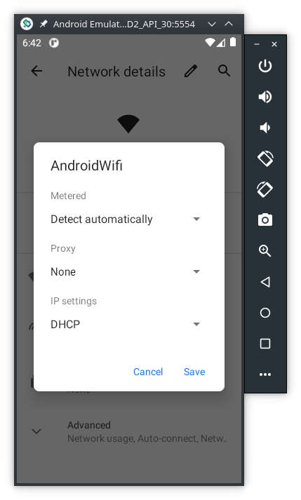

# Tutorial: Android Network Traffic Interception <!-- omit in toc -->
How to intercept network trafic on Android 

|         |           |
| :-:     | :--       |
|  | This work is licensed under a [Creative Commons Attribution-NonCommercial-ShareAlike 4.0 International License](http://creativecommons.org/licenses/by-nc-sa/4.0/) |

## Table of Contents <!-- omit in toc -->

- [Requirements](#requirements)
- [Methods](#methods)
- [Digital Certificates](#digital-certificates)
- [Configuration -- Using a fake VPN on Android](#configuration----using-a-fake-vpn-on-android)
- [Bypass Certificate Pinning](#bypass-certificate-pinning)
  - [Install Frida on the PC](#install-frida-on-the-pc)
  - [Install Frida on Android](#install-frida-on-android)
  - [Intercept networt traffic from APPS with certificate pinning](#intercept-networt-traffic-from-apps-with-certificate-pinning)
- [Configuration -- Using a proxy on a computer (alternative way)](#configuration----using-a-proxy-on-a-computer-alternative-way)
  - [On the computer](#on-the-computer)
  - [On the Android device](#on-the-android-device)

## Requirements

In order to implement this tutorial you need one of these Android devices:

- Android Virtual Device (AVD) -- see one of these tutorials: [Android Studio Emulator - GUI](https://labcif.github.io/AndroidStudioEmulator-GUIconfig/), or [Android Studio Emulator - command line](https://labcif.github.io/AndroidStudioEmulator-cmdConfig/) to learn how to set up an AVD;
  - Android 11 (API version 30), or older, is recommended for this tutorial
- or a physical smartphone with Android rooted. Rooting an Android device is beyond the scope of this tutorial, but you can read this [webpage](https://magiskmanager.com/) to learn more about it.

> ***NOTE***
>
> The Android emulator uses the `x86`, or `x86_64` CPU instruction set. However, some APPs are compiled only for `arm`, or `arm64` CPU architectures. 
> If the APP you are analysing does not provide a version for `x86`, or `x86_64`, you need to use **Android 9**, or **Android 11** on the emulator, because these versions include a translation mechanism from `arm` instructions to `x86`.

## Methods

To intercept the network traffic of an Android device we need a proxy. The proxy will act as Man-in-the-middle between the Android device and the servers it connects to. There are several ways to accomplish network traffic interception:

- using a proxy on a computer, like [mitmproxy](https://mitmproxy.org/), or [PolarProxy](https://www.netresec.com/?page=PolarProxy);
- using a fake VPN on Android to act like a proxy, like [Packet Capture](https://www.apkmirror.com/?s=packet+capture), or [PCAP Remote](https://github.com/egorovandreyrm/pcap-remote).
  
**Using a proxy on a computer** -- this method is a bit more complex to setup, but is the one that generally guarantees more flexibility to analyse the captured traffic. The main disadvantage is that all Android traffic is routed through the proxy and it's more difficult to find the packects related to the app we want to study.

**Using a fake VPN on Android** -- this is the simplest way to intercept traffic, and it allows to choose just one app to be redirected and captured. On one hand, no root permission is required, on the other hand it requires extra steps to download the captured packets to a computer.

For this tutorial we are going to use a fake VPN service created by the [Packet Capture](https://www.apkmirror.com/?s=packet+capture) app. Download and install it:

```console
user@linux:ANDROID_HOME/platform-tools$ adb install app.greyshirts.sslcapture_1.7.2-30.apk
Success
```


## Digital Certificates

To intercept TLS traffic we need to tell our device to trust the proxy's digital certificate.
The Packet Capture's included feature to install the digital certificate does not always work.
So, we're going to create one with `openssl`:

```console
user@linux:~$ openssl req -x509 -newkey rsa:4096 -keyout key-private.pem -out key-public.pem -days 3650
user@linux:~$ openssl pkcs12 -export -out keyBundle.p12 -inkey key-private.pem -in key-public.pem -name "alias"
```

> ***NOTE***
>
> When asked to provide an export password don't leave it empty, because some devices don't import `p12` files without a password. Chose whatever password you want, like `1234`.

Now copy the `keyBundle.p12` file to your device:

```console
user@linux:~$ adb push keyBundle.p12 /sdcard/Download 
keyBundle.p12: 1 file pushed. 0.3 MB/s (4208 bytes in 0.012s)
```

Now install the CA digital certificate on your device. The menu path to do is not the same in all devices:

- AVD (API30): Settings -> Security -> Advanced -> Encryption & Credentials -> Install a certificate -> VPN & app user certificate -> Select file
- Samsung: Settings -> Biometrics and security -> Other security settings -> Install from device storage -> Select file


## Configuration -- Using a fake VPN on Android

Open Packet Capture, then, goto `settings -> Certificate` and select `keyBundle.p12`.

Afterwards, select the play button with the number `1` to redirect only one app to intercept.
Choose the Google Chrome browser.

To test, open the Chrome browser anf try to access any website. What happens?

Most likely you won't be able to access any website due to the Certificate Pinning protection. Keep reading to learn how to bypass it.

## Bypass Certificate Pinning

After the proxy is enabled and the digital certificates are properly configured, some APPS might still not work. That happens because they are able to detect that the digital certificate we are using is not the one they expect. This technique is called [certificate pinning](https://owasp.org/www-community/controls/Certificate_and_Public_Key_Pinning). Certificate pinning is an extra step to protect SSL/TLS network traffic from Man-in-the-middle attacks, which we are trying to do.

In order to bypass certificate pinning we need to dynammicly change the network traffic. The payed version of Fiddler is able to do that, but we can acheive the desired result with [Frida](https://frida.re/), an open source tool for dynamic interception and alteration of network traffic.

### Install Frida on the PC

To [install Frida](https://frida.re/docs/installation/) we need to have the latest Python 3.x. Then install Frida via `pip` tool:

```Console
user@linux:AFD2$ pip install frida-tools
```

Or grab the binaries from [Frida’s GitHub releases](https://github.com/frida/frida/releases) page.


### Install Frida on Android

To install Frida on Android, the device must be rooted first. For this tutorial we are going to use an Android Virtual Device (AVD) running Android 10 (API version 29).

> ***NOTE***
>
> Make sure `frida` already supports the Android version you're using.

Download the `frida-server` from [Frida’s GitHub releases](https://github.com/frida/frida/releases) page that **matches both**:

- The CPU architectutre of your Android device. If you are not sure check it by doing `adb shell` followed by `uname -m`;
- and the `frida` (client) version running on the desktop. If you are not sure check it by doing `frida --version`.

Then uncompress it with [7zip](https://www.7-zip.org/download.html), or on the Linux command line:

```Console
user@linux:AFD2$ unxz frida-server-15.1.16-android-x86_64.xz
```

> ***NOTE 1***
>
> Be aware that your emulator might be `x86` (32 bits) instead of the `x86_64` (64 bits) that is used in this tutorial.

> ***NOTE 2***
>
> If your are using a physical Android device, the CPU architecture could be `armv8l`,
> in that case you should download the `arm64` version of the `frida-server`.

Now, make sure your Android device is connected, copy `frida-server` to your device and run it as root, as shown here:

```Console
user@linux:AFD2$ adb devices   
List of devices attached
emulator-5554   device
user@linux:AFD2$ adb push ./frida-server-15.1.16-android-x86_64 /sdcard/Download/
./frida-server-15.1.16-android-x86_64/: 1 file pushed. 99.8 MB/s (41358640 bytes in 0.395s)
user@linux:AFD2$ adb shell 
generic_x86_64:/ $ su
generic_x86_64:/ # cd /data/local/tmp
generic_x86_64:/data/local/tmp # cp /sdcard/Download/frida-server-15.1.16-android-x86_64 frida-server
generic_x86_64:/data/local/tmp # chmod 755 frida-server
generic_x86_64:/data/local/tmp # ./frida-server &
[1] 6268
```

Open a new terminal and test if Frida is running:

```Console
user@linux:AFD2$ frida-ps -U
PID  Name
----  -------------------------------------------------------------
 359  adbd
 189  android.hardware.atrace@1.0-service
 272  android.hardware.audio.service.ranchu
 273  android.hardware.authsecret@1.0-service
 430  android.hardware.biometrics.face@1.0-service.example
...
```

> ***NOTE 1***
>
> If you installed Frida with `pip` you may need to add its location to the PATH:
>
> ```Console
> user@linux:AFD2$ export $PATH:$HOME/.local/bin
> ```
>
> On Windows, the default `PATH` to `pip` installed tools is (adapt according to your Python version):
>
> `C:\Users\<username>\AppData\Local\Packages\PythonSoftwareFoundation.Python.3.9_qbz5n2kfra8p0\LocalCache\local-packages\Python39\Scripts` 

> ***NOTE 2***
>
> If you need to terminate `frida-server` do (change `8888` to the actual PID):
> ```Console
> user@linux:AFD2$ adb shell
> a40:/ $ su
> a40:/ # ps -e | grep frida-server
> root          8888     1  139456   4416 poll_schedule_timeout 79c0dce088 S frida-server
> kill -9 8888
> ```

### Intercept networt traffic from APPS with certificate pinning

Suppose we want to bypass Google Chrome certificate pinning, the first step is to identify the package name:

```Console
user@linux:AFD2$ frida-ps -U | grep chrome
6061  com.android.chrome
6415  com.android.chrome:privileged_process0
6394  com.android.chrome:sandboxed_process0:org.chromium.content.app.SandboxedProcessService0:5
6384  com.android.chrome_zygote
```

Then apply the `javascript` that enables to bypass certificate pinning with Frida. In the computer run:

```Console
user@linux:~$ frida -U --codeshare akabe1/frida-multiple-unpinning -f <mobile-app-name> --no-pause
```

For the Google Chrome browser:

```Console
user@linux:~$ frida -U --codeshare akabe1/frida-multiple-unpinning -f com.android.chrome 
     ____
    / _  |   Frida 15.1.16 - A world-class dynamic instrumentation toolkit
   | (_| |
    > _  |   Commands:
   /_/ |_|       help      -> Displays the help system
   . . . .       object?   -> Display information about 'object'
   . . . .       exit/quit -> Exit
   . . . .
   . . . .   More info at https://frida.re/docs/home/
   . . . .
   . . . .   Connected to Android Emulator 5554 (id=emulator-5554)
Spawned `com.android.chrome`. Use %resume to let the main thread start executing!
[Android Emulator 5554::com.android.chrome ]-> %resume
[Android Emulator 5554::com.android.chrome ]->
======
[#] Android Bypass for various Certificate Pinning methods [#]
======
[-] OkHTTPv3 {1} pinner not found
...
```

If everything is working as expected, you should now see some `SSL` packets on Packet Capture:


> ***NOTE***
>
> Frida is able to avoid certificate pinning from many Android apps, **but not all of them**. For example, Tiktok is known to have implemented some technics against Frida and other similar tools.
>
> If the certificate pinning bypass is not working for your mobile app, try:
>
> - with an older version of the app itself,
> - or, use an older version of Android,
> - or both an older version of the app and older version of Android.


## Configuration -- Using a proxy on a computer (alternative way)

If you prefer to see, and save the packets with Wireshark, use the method described bellow instead of Packet Capture.

### On the computer

Install [PolarProxy](https://www.netresec.com/?page=PolarProxy)and Wireshark on the computer. Then run the proxy this way:


```Console
user@linux:~$ ./PolarProxy --certhttp 8088 --httpconnect 8080 -w - | wireshark -k -i -
<6>Starting PolarProxy 0.9.0.0
<6>[8080] HTTP CONNECT proxy listening on: 0.0.0.0:8080
...
```

On a browser type `localhost:8088` to download PolarProxy's digital certificate. Then install it as shown in the next section.

### On the Android device

In case you wanto to try the proxy on a computer your Android device must have the proxy enabled, here's a summary (for step by step instructions [read this tutorial](https://docs.telerik.com/fiddler-everywhere/get-started/mobile-traffic/configure-android#configure-android-device)):





> ***NOTE 1***
>
> If you have a firewall running on your computer make sure you allow traffic to the proxy, _specially if you are using a physical Android device_.

> ***NOTE 2***
>
> If you are using a physical Android device, after you configure the proxy the device may display a message similar to "Connected, but without Internet connection" and show also a `!` next to the Wifi symbol. 
> To remove this message and the `!` do:
>
> ```Console
> user@linux:AFD2$ adb shell
> a40:/ $ su
> a40:/ # settings put global captive_portal_detection_enabled 0   
> ```

Now run `frida` as shown previously and you should start to see packets in Wireshark.
