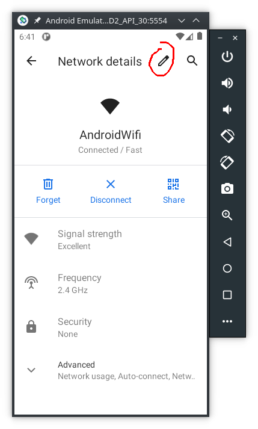
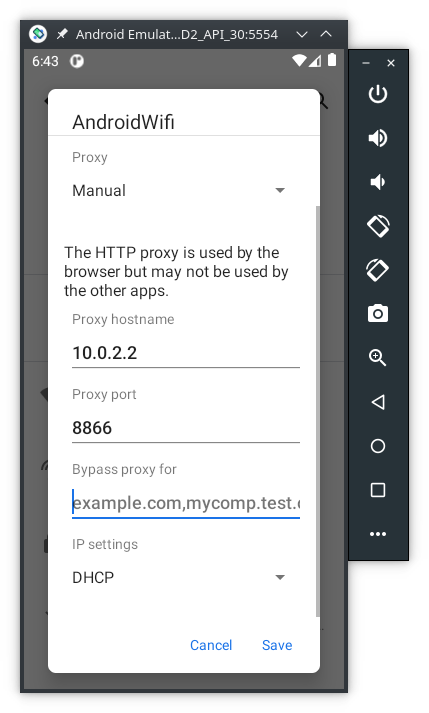

# Tutorial: Android Network Traffic Interception <!-- omit in toc -->
How to intercept network trafic on Android 

|         |           |
| :-:     | :--       |
|  | This work is licensed under a [Creative Commons Attribution-NonCommercial-ShareAlike 4.0 International License](http://creativecommons.org/licenses/by-nc-sa/4.0/) |

## Table of Contents <!-- omit in toc -->

- [Requirements](#requirements)
- [Digital Certificates](#digital-certificates)
  - [Test configuration](#test-configuration)
- [Bypass Certificate Pinning](#bypass-certificate-pinning)
  - [Install Frida on the PC](#install-frida-on-the-pc)
  - [Install Frida on Android](#install-frida-on-android)
  - [Intercept networt traffic from APPS with certificate pinning](#intercept-networt-traffic-from-apps-with-certificate-pinning)

## Requirements

In order to implement this tutorial you need one of these Android devices:

- Android Virtual Device (AVD) -- see one of these tutorials: [Android Studio Emulator - GUI](https://labcif.github.io/AndroidStudioEmulator-GUIconfig/), or [Android Studio Emulator - command line](https://labcif.github.io/AndroidStudioEmulator-cmdConfig/) to learn how to set up an AVD;
- or a physical smartphone with Android rooted. Rooting an Android device is beyond the scope of this tutorial, but you can read this [webpage](https://magiskmanager.com/) to learn more about it.

## Digital Certificates

To intercept the network traffic of an Android device we need a proxy. The proxy will act as Man-in-the-middle between the Android device and the servers it connects to.

There are several proxies that can be used to accomplish the interception, for this tutorial we are going to use the free version of [Fiddler Everywhere](https://www.telerik.com/download/fiddler-everywhere).

Download Fiddler for your Operating System (OS) and follow the steps in [their webpage to install it](https://docs.telerik.com/fiddler-everywhere/get-started/installation-procedure).

In order to decrypt SSL/TLS traffic we need to install Fiddler's digital certificate on our computer, and on our Android device (AVD on our example). Follow the instructions in these webpages:

- [for the computer running Fiddler proxy](https://docs.telerik.com/fiddler-everywhere/get-started/configuration)
- [for the Android device to be intercepted](https://docs.telerik.com/fiddler-everywhere/get-started/mobile-traffic/configure-android#configure-android-device)
  - if typing `http://ipv4.fiddler:8866` on the Android browser doesn't work, type your computer IP address instead, for example: `http://192.168.1.10:8866`

### Test configuration

Now, on your computer, start Fiddler (or, other the proxy software) and make sure it is configured to capture HTTPS traffic. Go to `settings` -> `HTTPS` -> and enable `Capture HTTPS traffic` -> `Save`:


Then make sure your AVD has proxy enabled, here's a summary (for step by step instructions [read this tutorial](https://docs.telerik.com/fiddler-everywhere/get-started/mobile-traffic/configure-android#configure-android-device)):






If everything is configured correctly, open Chrome in the AVD, type something in the search bar and you should be able to see some `CONNECT` packets inside Fiddler's window.

> ***NOTE 1***
>
> If you have a firewall running on your computer make sure you allow traffic to the proxy, _specially if you are using a physical Android device_.

> ***NOTE 2***
>
> If you are using a physical Android device, after you configure the proxy the device may display a message similar to "Connected, but without Internet connection" and show also a `!` next to the Wifi symbol. 
> To remove this message and the `!` do:
>
> ```Console
> user@linux:AFD2$ adb shell
> a40:/ $ su
> a40:/ # settings put global captive_portal_detection_enabled 0   
> ```

After the proxy is enabled some APPS might still not work. That happens because they are able to detect that the digital certificate we are using is not the one they expect. This technique is called **Certificate Pinning**.

## Bypass Certificate Pinning

Nowadays, many websites and mobile applications use an extra step to protect their traffic from Man-in-the-middle attacks, that is called [certificate pinning](https://owasp.org/www-community/controls/Certificate_and_Public_Key_Pinning). 

In order to bypass certificate pinning we need to dynammicly change the network traffic. The payed version of Fiddler is able to do that, but for this purpose we can acheive the desired result with [Frida](https://frida.re/), an open source tool for dynamic interception and alteration of network traffic.

### Install Frida on the PC

To [install Frida](https://frida.re/docs/installation/) we need to have the latest Python 3.x. Then install Frida via `pip` tool:

```Console
user@linux:AFD2$ pip install frida-tools
```

Or grab the binaries from [Frida’s GitHub releases](https://github.com/frida/frida/releases) page.

### Install Frida on Android

To install Frida on Android, the device must be rooted first. We are going to use Android Virtual Device (AVD).

> ***NOTE***
>
> Do not use the last version of Androind, for this tutorial we are going to use Android 10 (API version 29).

Download the latest frida-server from [Frida’s GitHub releases](https://github.com/frida/frida/releases) page and uncompress it with [7zip](https://www.7-zip.org/download.html), or on the Linux command line:

```Console
user@linux:AFD2$ unxz frida-server-14.2.14-android-x86_64.xz
```

> ***NOTE***
>
> If your are using a physical Android device, download the `arm64` version of the file, instead of `x86_64`.

Now, make sure the AVD is running and push `frida-server` and run it as root:

```Console
user@linux:AFD2$ adb devices   
List of devices attached
emulator-5554   device
user@linux:AFD2$ adb push ./frida-server-14.2.14-android-x86_64 /sdcard/Download/
./frida-server-14.2.14-android-x86_64/: 1 file pushed. 99.8 MB/s (41358640 bytes in 0.395s)
user@linux:AFD2$ adb shell 
generic_x86_64_arm64:/ $ su
generic_x86_64_arm64:/ # cd /data/local/tmp
generic_x86_64_arm64:/data/local/tmp # cp /sdcard/Download/frida-server-14.2.14-android-x86_64 frida-server
generic_x86_64_arm64:/data/local/tmp # chmod 755 frida-server
generic_x86_64_arm64:/data/local/tmp # ./frida-server &
[1] 6268
```

Open a new terminal and test if Frida is running:

```Console
user@linux:AFD2$ frida-ps -U
PID  Name
----  -------------------------------------------------------------
 359  adbd
 189  android.hardware.atrace@1.0-service
 272  android.hardware.audio.service.ranchu
 273  android.hardware.authsecret@1.0-service
 430  android.hardware.biometrics.face@1.0-service.example
...
```

> ***NOTE***
>
> If you installed Frida with `pip` you may need to add `$HOME/.local/bin` to the PATH:
>
> ```Console
> user@linux:AFD2$ export $PATH:$HOME/.local/bin
> ```

### Intercept networt traffic from APPS with certificate pinning

Suppose we want to bypass Google Chrome certificate pinning, the first step is to identify the package name:

```Console
user@linux:AFD2$ frida-ps -U | grep chrome
6061  com.android.chrome
6415  com.android.chrome:privileged_process0
6394  com.android.chrome:sandboxed_process0:org.chromium.content.app.SandboxedProcessService0:5
6384  com.android.chrome_zygote
```

Then apply the `javascript` that enables to bypass certificate pinning with Frida. In the computer run:

```Console
user@linux:~$ frida -U --codeshare akabe1/frida-multiple-unpinning -f <mobile-app-name> --no-pause
```

For the Google Chrome browser:

```Console
user@linux:~$ frida -U --codeshare akabe1/frida-multiple-unpinning -f com.android.chrome --no-pause
     ____
    / _  |   Frida 14.2.13 - A world-class dynamic instrumentation toolkit
   | (_| |
    > _  |   Commands:
   /_/ |_|       help      -> Displays the help system
   . . . .       object?   -> Display information about 'object'
   . . . .       exit/quit -> Exit
   . . . .
   . . . .   More info at https://www.frida.re/docs/home/
Spawned `com.android.chrome`. Resuming main thread!                     
[Android Emulator 5556::com.android.chrome]->
======
[#] Android Bypass for various Certificate Pinning methods [#]
======
[-] OkHTTPv3 {1} pinner not found
...
```

If everything is working as expected, you should now see `POST` and `GET` on Fiddler's windows. On Fiddler, select the packets you want and export them to latter inspect them.


> ***NOTE***
>
> Frida is able to avoid certificate pinning from many Android apps, **but not all of them**. For example, Tiktok is known to have implemented some technics against Frida and other similar tools.
>
> If the certificate pinning bypass is not working for your mobile app, try:
>
> - with an older version of the app itself,
> - or, run it with an older version of Android.
