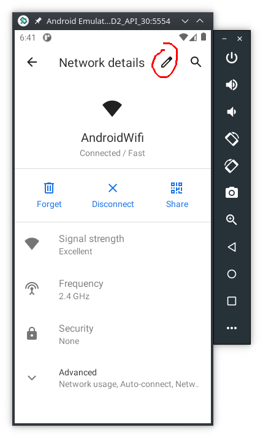
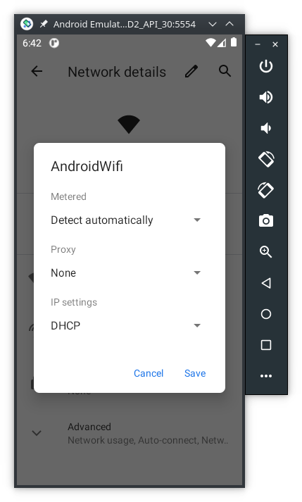
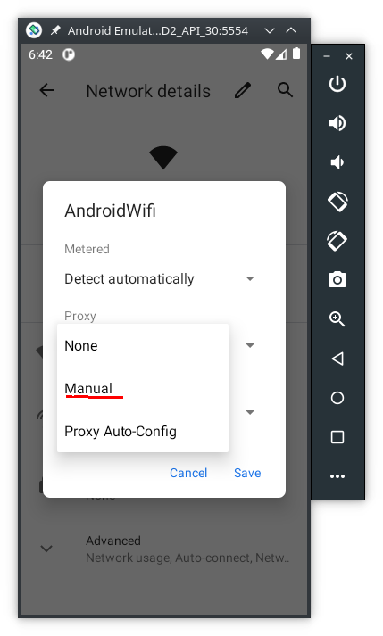
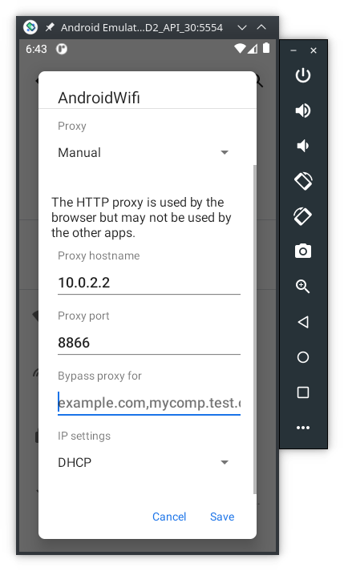

## Digital Certificates

To intercept TLS traffic we need to tell our device to trust the proxy's digital certificate.
The Packet Capture's included feature to install the digital certificate does not always work.
So, we're going to create one with `openssl`:

```console
user@linux:~$ openssl req -x509 -newkey rsa:4096 -keyout key-private.pem -out key-public.pem -days 3650
user@linux:~$ openssl pkcs12 -export -out keyBundle.p12 -inkey key-private.pem -in key-public.pem -name "alias"
```

> ***NOTE***
>
> When asked to provide an export password don't leave it empty, because some devices don't import `p12` files without a password. Chose whatever password you want, like `1234`.

Now copy the `keyBundle.p12` file to your device:

```console
user@linux:~$ adb push keyBundle.p12 /sdcard/Download 
keyBundle.p12: 1 file pushed. 0.3 MB/s (4208 bytes in 0.012s)
```

Now install the CA digital certificate on your device. The menu path to do is not the same in all devices:

- AVD (API30): Settings -> Security -> Advanced -> Encryption & Credentials -> Install a certificate -> VPN & app user certificate -> Select file
- Samsung: Settings -> Biometrics and security -> Other security settings -> Install from device storage -> Select file


## Configuration -- Using a fake VPN on Android

Open Packet Capture, then, goto `settings -> Certificate` and select `keyBundle.p12`.


## Configuration -- Using a proxy on a computer (optional)

Another option is to use `mitmproxy`, but in order to do that

### On the computer

Install [PolarProxy](https://www.netresec.com/?page=PolarProxy)and Wireshark on the computer. Then run the proxy this way:


```Console
user@linux:~$ ./PolarProxy --certhttp 8088 --httpconnect 8866 -w - | wireshark -k -i -
<6>Starting PolarProxy 0.9.0.0
<6>[8080] HTTP CONNECT proxy listening on: 0.0.0.0:8080
...
```

On a browser type `localhost:8088` to download PolarProxy's digital certificate. Then install it as explained above. The next section describes the Android configuration to use a proxy.

### On the Android device

In case you wanto to try the proxy on a computer your Android device must have the proxy enabled, here's a summary (for step by step instructions [read this tutorial](https://docs.telerik.com/fiddler-everywhere/get-started/mobile-traffic/configure-android#configure-android-device)):









> ***NOTE 1***
>
> If you have a firewall running on your computer make sure you allow traffic to the proxy, _specially if you are using a physical Android device_.

> ***NOTE 2***
>
> If you are using a physical Android device, after you configure the proxy the device may display a message similar to "Connected, but without Internet connection" and show also a `!` next to the Wifi symbol. 
> To remove this message and the `!` do:
>
> ```Console
> user@linux:AFD2$ adb shell
> a40:/ $ su
> a40:/ # settings put global captive_portal_detection_enabled 0   
> ```

Now run `frida` as shown previously and you should start to see packets in Wireshark.
